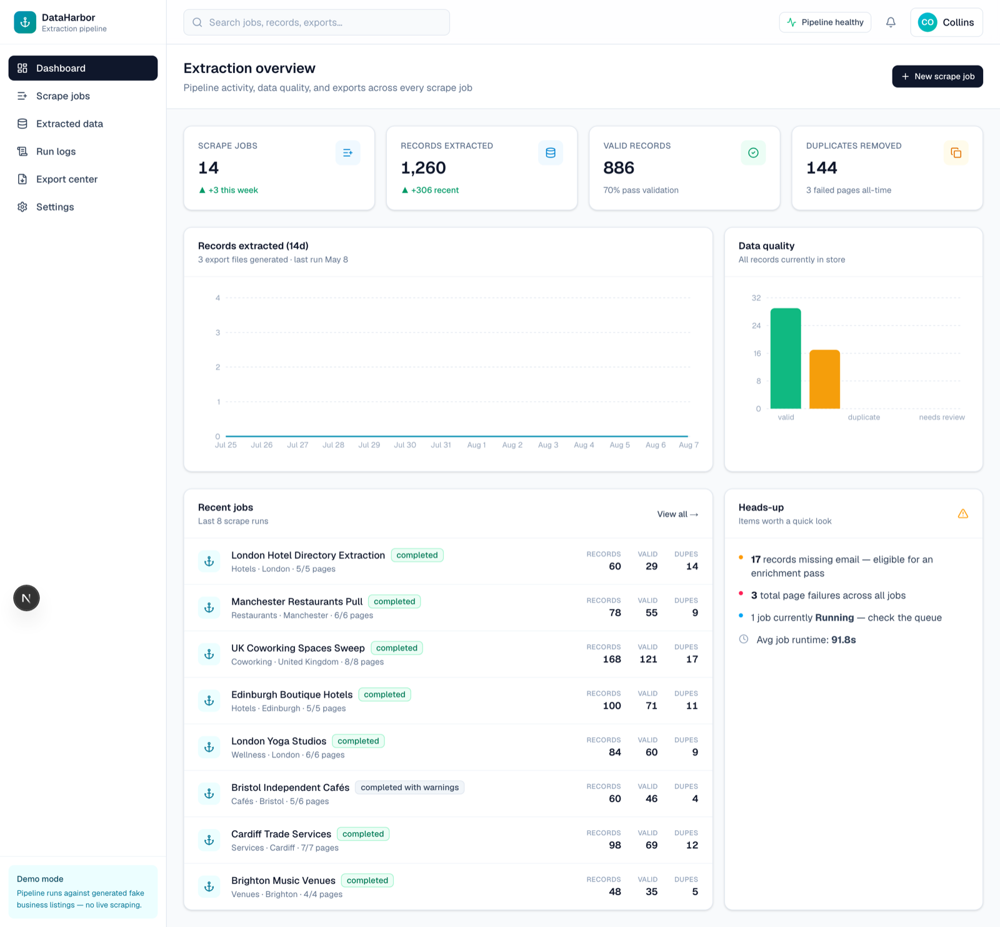
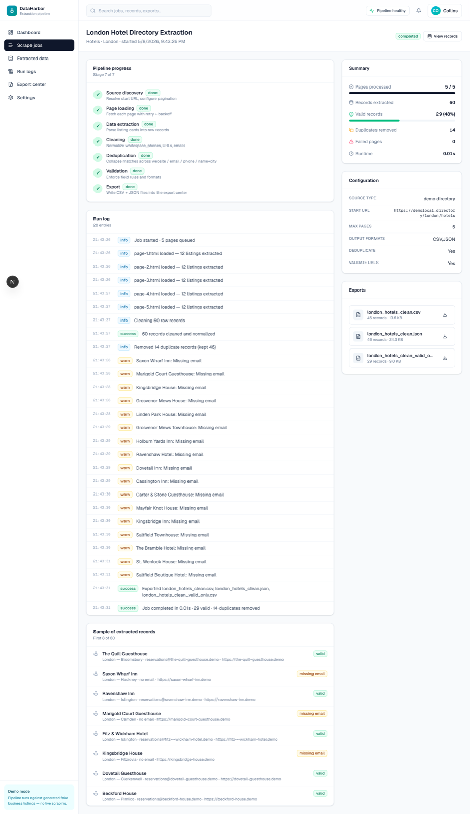
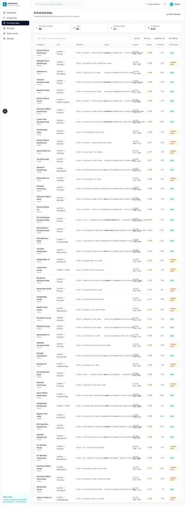

# DataHarbor

Web scraping and data extraction pipeline. Portfolio piece pairing a real Python scraping engine with a Next.js dashboard so the engineering and the operator experience are both visible.



> **Portfolio demo.** The pipeline runs against a generated fictional London-hotels directory written to disk as static HTML — no third-party scraping, no surprise rate limits, fully reproducible.

## Screenshots

| Job detail — 7-stage pipeline | Cleaned records |
| --- | --- |
|  |  |

## What's in here

### Python scraping engine (`scraper/dataharbor/`)

Pure stdlib, single-responsibility modules:

```
fetcher.py       # load HTML with retries + exponential backoff
parser.py        # html.parser-based listing extractor
cleaner.py       # whitespace, phone, email, URL normalisation
validator.py    # email/URL formats, rating bounds, required fields
deduplicator.py  # collapse on website / email / phone / name+city
exporter.py      # CSV + JSON exporters
runner.py        # end-to-end orchestrator → JobResult
fixtures.py      # generates the demo source HTML pages
```

`run_demo.py` runs the pipeline end-to-end and emits a JSON summary on stdout. The Node-based seeder (`prisma/seed.ts`) shells out to it and writes results into SQLite.

### Next.js dashboard (`src/app/`)

- **Dashboard** — total jobs, records extracted, valid count, duplicates removed, 14-day extraction trend, data quality bar chart, recent jobs, heads-up panel
- **Scrape jobs** — list with status pills, per-job progress, records / valid / dupes / runtime
- **New job** — full configurator with source type, URL, category, location, max pages, output formats, pipeline options
- **Job detail** — 7-stage pipeline progress, full run log, sample records, summary metrics, configuration, exports
- **Extracted data** — searchable table of all records with validation status badges
- **Record detail** — full contact fields, source URL lineage, validation issues
- **Run logs** — per-job step trace with INFO / WARN / ERROR / SUCCESS levels
- **Export center** — CSV / JSON files with size, record count, download
- **Settings** — defaults, cleaning rules, validation rules, integrations

## Stack

| Layer | Choice |
| --- | --- |
| Scraping engine | Python 3.11, stdlib only (`html.parser`, `csv`, `json`, `pathlib`) |
| Framework | Next.js 16 (App Router) |
| UI | React 19, Tailwind CSS v4 |
| Database | SQLite via Prisma |
| Charts | Recharts |
| Bridge | Node seeder spawns the Python scraper and pipes JSON into the DB |

## Run it locally

```bash
# 1. Install Node dependencies
npm install

# 2. Apply the schema
npx prisma migrate dev --name init

# 3. Seed: this runs the Python scraper, then writes results into SQLite.
#    Python 3.11 is required, no pip dependencies needed.
npm run db:seed

# 4. Start the dashboard
npm run dev
```

Visit http://localhost:3000 (the root redirects to `/dashboard`).

### Scripts

```bash
npm run dev          # dev server
npm run scrape:demo  # run the Python pipeline standalone (writes data/raw/last_run.json)
npm run db:seed      # run scraper + write results to SQLite
npm run db:reset     # reset migrations + reseed
```

### Standalone Python usage

```bash
python3 scraper/run_demo.py | jq .metrics
```

```json
{
  "pages_processed": 5,
  "failed_pages": 0,
  "records_extracted": 60,
  "valid_records": 29,
  "duplicates_removed": 14,
  "runtime_seconds": 0.01
}
```

CSV / JSON exports land in `data/exports/`.

## Repo layout

```
dataharbor/
├── scraper/
│   ├── dataharbor/                  # the engine
│   │   ├── fixtures.py              # generates the demo source
│   │   ├── fetcher.py
│   │   ├── parser.py
│   │   ├── cleaner.py
│   │   ├── validator.py
│   │   ├── deduplicator.py
│   │   ├── exporter.py
│   │   └── runner.py
│   └── run_demo.py                  # CLI entry → JSON on stdout
├── data/
│   ├── demo_source/                 # generated fake HTML pages
│   ├── raw/                         # cached scraper runs
│   └── exports/                     # CSV / JSON outputs
├── prisma/
│   ├── schema.prisma                # ScrapeJob, ExtractedRecord, ScrapeLog, ExportFile
│   └── seed.ts                      # spawns Python scraper, writes to SQLite
├── src/
│   ├── app/
│   │   ├── (app)/
│   │   │   ├── dashboard/
│   │   │   ├── jobs/                # list + new + detail
│   │   │   ├── data/                # records list + detail
│   │   │   ├── logs/
│   │   │   ├── exports/
│   │   │   └── settings/
│   │   └── page.tsx                 # / → /dashboard
│   ├── components/                  # ui/, layout/, charts/
│   └── lib/
│       ├── db.ts
│       └── utils.ts
└── .env.example                     # copy to .env before first run
```

## Promoting it to live targets

1. Replace the file-system-only branch in `fetcher.py` with `requests.get(...)` (or `httpx`). The interface already accepts both.
2. Swap the stdlib `html.parser` parser for BeautifulSoup or selectolax in `parser.py` for richer CSS selectors.
3. Honour `robots.txt` (a `urllib.robotparser` check before fetching).
4. Per-host rate-limiting (`time.sleep` in `runner.py` between requests).
5. Persistent fetch cache to `data/raw/` keyed by URL hash, so reruns are cheap.

## License

[MIT](./LICENSE) — free to use, modify, and distribute with attribution.
